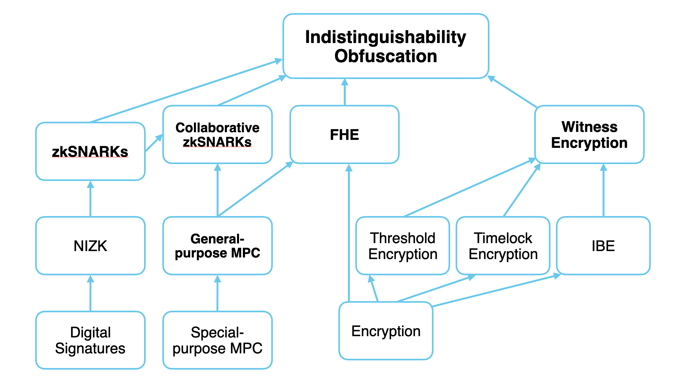
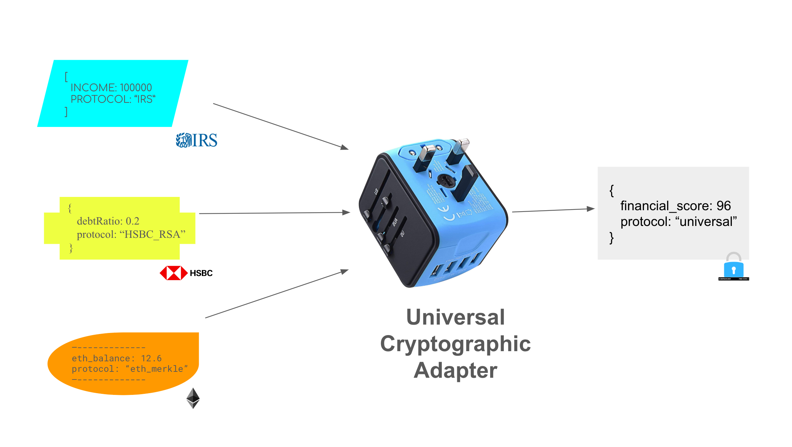
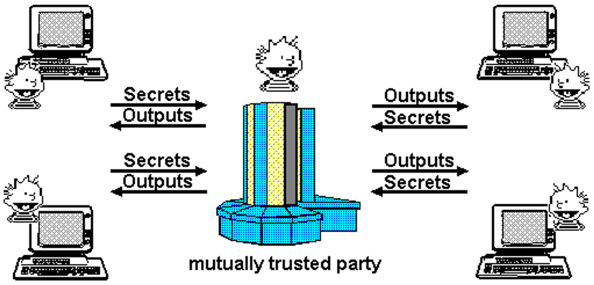
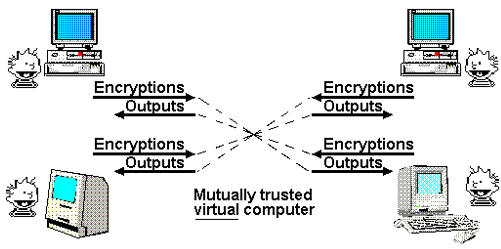

<link rel="stylesheet" href="/tools/styles/r0-theme.css">

<section data-background-opacity=0.3>

# Programmable Cryptography

### _Actualizing Academic Innovation for Novel Technology_



<!-- FIXME: Math doesn't render offline! jsdeliver hard coded.-->

<a target="_blank" href="https://nuke-web3.github.io/book/risc-zero/dc303-meetup/materials.html">Meetup Materials ↗️</a>

Notes:

Based almost completely on this _**awesome**_ blog by 0xPARC: https://0xparc.org/blog/programmable-cryptography-1

---

## 🤩 Crypto-Revolution

> Cryptography is undergoing a generational transition,</br>
> **from special-purpose cryptography to programmable cryptography**.

---

### Programable Crypto Tech Tree


Notes:

- **Fully-homomorphic encryption (FHE)** allows me to compute an arbitrary program over someone else’s private data, without learning anything about the data or the output of the computation.
- **Multi-party computation (MPC)** allows me to compute an arbitrary program over multiple peoples' private data, without learning anything about the data except for the output of the computation.
- **zkSNARKs** allow me to prove that an arbitrary piece of code was executed correctly on some secret inputs that only I know, without revealing anything about those inputs.
  - With "special-purpose" zero-knowledge proofs, I could make a claim like: I have a secret S such that "MODEXP(S) = 0xa91af3ac..." (where MODEXP is the modular exponentiation function), and I can prove this to you without revealing S.
  - With "general-purpose" zkSNARKs, I can do this not only for the specific function MODEXP--I can do this for any function you want.
  - **Witness encryption** allows me to encrypt a message to a program, rather than a secret key. For example, I could set up a math research prize by encrypting a Bitcoin wallet with a program encoding a check: “this wallet containing 1000BTC is only decryptable if you possess a proof of the Riemann Hypothesis."
- **Obfuscation** allows me to "encrypt" a program. This means scrambling the program such that someone else can run it on any inputs of their choosing and produce the correct outputs, but they can't learn anything1 about the program’s internal state or structure.

---

## Coming Soon™️

> The first instances of programmable cryptography have just started</br>to become practical for developers in real-world use cases.</br></br>
> In the coming decade, the performance, accessibility,</br>and capabilities of programmable cryptography will increase dramatically.

---

## What can we do with programmable cryptography?

General-purpose, programmable cryptography enables us to build computing systems with powerful new properties, that couldn’t have existed before. Here are three examples.

---

## The Universal Protocol



Notes:

- Universal Protocol for all of your social data, digital identity, financial interactions, professional history, medical data, and everything and anything else attached to you. The Universal Protocol specifies a universal data format, and a procedure for verifying the correctness and origin(s) of any data. The Universal Protocol is also extraordinarily flexible--in fact, it's Turing complete. Any computable function that is run on Universal Protocol data will result in an output that also conforms to the protocol, and that retains its cryptographic integrity.
  - Universal Cryptographic Adapters, based on technologies like zkSNARKs, allow us to compose and transform data originating from any source cryptographic protocol/format to any destination.

- Port your social data across all social platform--you can move your likes, friends, followers, history, and reputation seamlessly across Facebook, Twitter, Reddit, Instagram, etc.
- Financial intermediaries such as Equifax, Transunion, or Experian are replaced with cryptographic protocols on every consumer device; your smartphone can generate a cryptographically secure response to any query about your financial history or health, while keeping your underlying data private and in your own control.
- A network of universal and interoperable digital identity standards arise that are accepted by all websites, businesses, government agencies, universities, and more. These standards are permissionless--they rely on cryptography, rather than needing everyone to register with or query a specific authority.

---

## Hallucinated Servers

<nuke-cols>
<nuke-col>



</nuke-col>
<nuke-col>



</nuke-col>
</nuke-cols>

Notes:

- In a decade or two, the process of setting up and deploying applications on the Web might look very different. Many application backends might run inside VMs that are cryptographically "hallucinated" by their users at runtime.
- You could build services that execute over participants' data without ever interacting with the data directly; in fact, you could build virtual applications that maintain and compute over a state that _no one knows_!

Applications:

- Discover personalized recommendations for a product, a movie, a job, or even a date with a personalized cryptographic agent that is constantly searching on your behalf, without your data ever leaving your computer.
- Spin up a new, virtual social media platform "on the fly" for a community you're in, that hooks into all of your data from other social media platforms, without needing to run a server yourself or rely on any centralized intermediary to do so.
- Automatically get notified that you are at risk of some disease / medical outcome, without needing to share your medical data with anyone.

---

## ... And _Many_ More!

> ### What might you create?</br>
>
> See the [0xPARC blog](https://0xparc.org/blog/programmable-cryptography-1) for more.

Notes:

Discussion time!

---

# Enter: RISC Zero

## ~~Zero Knowledge~~ _Verifiable_ Virtual Machine

> ⚠ Company shill' 😉

---

## Why RISC Zero?

> ### _Write Rust 🦀_
>
> ### _Not Circuits 𝛌_

Notes:

### Story time!

Started in self-sovereign tech rabbit whole 2018 ETHDenver.
Mesh networks, local first, DAOs and co-ops, token engineering...
Then I found out about ZKPs and what they can do to fundamentally change the game and enable things that were impossible before.
As an fanboi of the ZK Podcast for years, I wanted so much to get in... but there was a problem: learning curve on cryptography.
I want to build cryptographic systems, but not need to deeply understand the moon math... Enter zkVMs: RISC Zero.
Now we can all make ZKPs with only a strong conceptual grasp of constraint systems and Rust (more languages to come!)

---

## Why RISC Zero?

- **Verifiable Computation**: outsource-able
- **Highly Scalable**: low-cost verification
- **Tunable Privacy**: robust & universal\*

Notes:

- you can verify that a computation of a specific program ran exactly as it should, even if done by untrusted executor!
- _Prover_ that runs program & produces _receipt_ reveals as little as nothing to everything about execution to _verifier_.
- Verification is significantly cheaper than running computation yourself... at the cost of prover doing significantly more work to run the _zkVM_
- \* Privacy is from everyone outside the prover, if you are the prover, no one but you has secret data.

---

## RISC Zero 101


> Recall: the **RECEIPT** contains the Seal & Journal (Committed Outputs)

Notes:

- deeper understanding as exercise for views of this presentation.
- very happy to answer questions on our discord!

---

# Seal

- The seal is a zk-STARK or zk-SNARK.
- It cryptographically attests to the correct execution of the `guest program`.
- The `guest program` is checking the parity of `x` --> proof.

Notes:

The `seal` is either a STARK or a SNARK generated by the prover (a party off-chain, we’ll delve into the specifics of Bonsai as a coprocessor later).
The `seal` cryptographically attests to correct execution of the `guest program` as well as the outputs of that guest program.
The `guest program` is a Rust program which takes an input number, `x` and checks if `x` is divisible by 2, if so the computation executes successfully and a proof is generated.

So we have the `seal`, in this case as we’re dealing with an onchain environment, it’s a SNARK.
SNARKs are smaller proofs compared to STARKs, making them more gas-efficient for onchain verification.

---

# Journal

- Contains the public outputs of the computation

```solidity [2|1-5]
function set(uint256 x, bytes calldata seal) public {
    bytes memory journal = abi.encode(x);
    verifier.verify(seal, imageId, sha256(journal));
    number = x;
}
```

Notes:

The journal contains the public outputs of the computation.
We’ll see later on that we used Solidity’s ABI encoding when ‘committing` x to the journal.
This is done to make decoding information easier on the Solidity side of things once we’re in the app contract as we are here.

We are taking a number x in the input of the solidity function, we’d like to make sure that this number x is the one that was checked to be even in the guest program.
For this reason, we actually reconstruct the journal onchain here, and pass that through to the verify function.
If the journal does not match the proof, verify will fail.
So that’s a handy way of making sure that everything is going smoothly.

A quick note, this reconstruction of the journal is not always feasible.
This example is straightforward, and handles only one number variable.
Most real world applications, including those that you’ll build yourself, will have a higher degree of complexity.
In those cases, recreating the journal onchain might seem counterintuitive in a world where we are trying to save gas.
In most cases, passing the journal through as an argument and decoding that onchain to have some sanity checks would be the better way of doing it.
This will become a lot clearer later, when Nuke comes back on to walk you through the guest program specifically.

---

# Verification

```solidity [3|1-5]
function set(uint256 x, bytes calldata seal) public {
    bytes memory journal = abi.encode(x);
    verifier.verify(seal, imageId, sha256(journal));
    number = x;
}
```

Notes:

Verification is handled by RISC Zero’s verification contract, which you can find deployed across many different chains.
In our application contract, the verification contract address is instantiated at deploy time as a constructor argument.
The verification contract is actually a proxy contract, and so you can be sure if any new features are added to the verification contract, this address will stay valid in your application.

verify takes the seal or the proof, the imageId and a hash of the journal.
The proof is verified and the imageId and journal variables here attest that the correct ELF binary was run in the zkVM with the corresponding identifier imageId, and the correct outputs were calculated within the zkVM via the journal.
Note that if anything is wrong, the verify function will revert and the error will be bubbled up through require statements, which you can see with the likes of Tenderly simulations when debugging on testnets before deploying to production on mainnet.

Going back to the function as a whole, and you can now see that, given the guest program does indeed check if a number is even, that the two functions that were shown previously are in fact identical in their conclusion: only update the state of number if it’s even.

---

## zkSnake Demo

<iframe loading=lazy width="560" height="315" src="https://www.youtube-nocookie.com/embed/M8oDQ00P3Eg?&amp;controls=0&autoplay=1&mute=1" title="YouTube video player" frameborder="0" allow="accelerometer; autoplay; clipboard-write; encrypted-media; gyroscope; picture-in-picture; web-share" referrerpolicy="strict-origin-when-cross-origin" allowfullscreen></iframe>

Notes:

- Go over gameplay
- After click on mint button
  - transaction with game data gets sent onchain
  - data gets picked up by risc0
  - risc0 Bonsai generates a proof
  - proof gets published and nft gets minted

---

# 🙇 Thank You! 🎉

> Any Questions?
