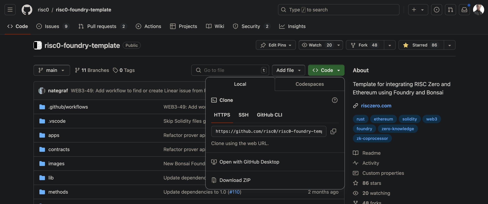

<link rel="stylesheet" href="/tools/styles/r0-theme.css">

<section data-background-opacity=0.3>

# Boundless On-chain Execution 

## Using Proven Off-chain Coprocessing


<!-- FIXME: Math doesn't render offline! jsdeliver hard coded.-->

**_On-chain_ $~~~$ 👉 $ZK$ 👈 $~~~$ _Off-chain_**

<a target="_blank" href="https://nuke-web3.github.io/book/risc-zero/zk-hack-montreal/materials.html">Event Materials ↗️</a>

---

## Why RISC Zero?

> ### _Write Rust 🦀_
>
> ### _Not Circuits 𝛌_

Notes:

### Story time!

Started in self-sovereign tech rabbit whole 2018 ETHDenver.
Mesh networks, local first, DAOs and co-ops, token engineering...
Then I found out about ZKPs and what they can do to fundamentally change the game and enable things that were impossible before.
As an fanboi of the ZK Podcast for years, I wanted so much to get in... but there was a problem: learning curve on cryptography.
I want to build cryptographic systems, but not need to deeply understand the moon math...
Enter zkVMs: RISC Zero.
Now we can all make ZKPs with only a strong conceptual grasp of constraint systems and Rust (more languages to come!)

---

## Why RISC Zero?

- **Verifiable Computation**: outsource-able
- **Highly Scalable**: low-cost verification
- **Tunable Privacy**: robust & universal\*

Notes:

- you can verify that a computation of a specific program ran exactly as it should, even if done by untrusted executor!
- _Prover_ that runs program & produces _receipt_ reveals as little as nothing to everything about execution to _verifier_.
- Verification is significantly cheaper than running computation yourself... at the cost of prover doing significantly more work to run the _zkVM_
- \* Privacy is from everyone outside the prover, if you are the prover, no one but you has secret data.

---

## What key web3 problems can ZK address?

<nuke-cols>
<nuke-col center>

### EVM Devs

- **Referring to historical state**
- **Trusting off-chain logic**
- **Boundless Execution**

</nuke-col>
<nuke-col center>

### Layer <0|1|2|...> Devs

- **True ZK (Privacy)**
- **Scalability (Compression)**
- **Interoperability (🌉, rollups)**

</nuke-col>
</nuke-cols>

> See RISC Zero <a target="_blank" href="https://dev.risczero.com/api/use-cases">docs</a> and <a target="_blank" href="https://risczero.com/blog">blog</a> for **lots** more

Notes:

- RETH / REVM -> ZETH - support EVM execution of contracts, REVM for only parts.
  - Also supports verifiable merkle proof of subset of global evm state.
- **ZK coprocessor** - run verifiable program logic in zkVM by 3rd party or yourself to untrusting parties
- Added **security** and **fairness** and **privacy** that zero knowledge proofs can provide, as they involve complex decision-making and competitive interactions.
- Privacy is optional, fully transparent games with ZKPs _can_ provided added guarantees around many things other than that (if carefully designed)

---

## RISC Zero Bounties

- 🤩 Best zkVM Application - _2x 500 USD_
- 🤝 ZK Coprocessor - _4x 500 USD_
- 👪 Integrations - _**15x** 200 USD_

<br/>

> **Qualifications on [Devfolio](https://zk-hack-montreal.devfolio.co/prizes?partner=RISC+Zero) 👀**

Notes:

---

## RISC Zero 101


> Read <a target="_blank" href="https://dev.risczero.com/api/getting-started">Getting Started</a> and/or watch the <a target="_blank" href="https://www.youtube.com/playlist?list=PLcPzhUaCxlCj7wKkzekYYq7QDvtGTOPm7">playlist</a>.

Notes:

- deeper understanding as exercise for views of this presentation.
- very happy to answer questions on our discord!

---

## RISC Zero 🤝 EVM Chains


> Read about <a target="_blank" href="https://dev.risczero.com/api/blockchain-integration/bonsai-on-eth">Blockchain Integration</a> and watch the <a target="_blank" href="https://www.youtube.com/playlist?list=PLcPzhUaCxlCgsTtFen4oxFIDkUMSVSFFo">Foundry Template playlist</a>.

---


Notes:

So you’ve heard about why you might want to use ZK and therefore, why you should use RISC Zero’s zkVM. Nuke’s done an excellent job there.
For my part of the presentation, let’s all put our blockchain developer hat on. For the longest time, this hat meant using Hardhat.

---


Notes:

The developer framework that's all the rage these days, and one that we are very fond of at RISC Zero is Foundry. Unfortunately, doesn't fit into my blockchain developer hat metaphor as we've switched to only metal metaphors becase of Rust.

---


Notes:

And its because of Rust, that Foundry integrates very well into the RISC Zero zkVM stack. We love it so much that we want to make developer's life easier and so we've created the Risc Zero Foundry template.

---



Notes:

You simply clone this repo and run a few commands to get started. Let's walkthrough that quickly and then we can get to the meat of understanding what's going on.

---

```bash
git clone https://github.com/risc0/risc0-foundry-template.git

```

---

```bash
curl -L https://risczero.com/install | bash

rzup

cargo risczero —version
```

Notes:

To install Rust or Foundry, you use the really handy `rustup` or `foundryup`. 

Well, now just like rustup and foundryup, you can type: curl -L https://risczero.com/install | bash followed by rzup. You can run cargo risczero —version to make sure everything installed correctly. j

---


Notes:

Now that we have the RISC Zero toolchain installed, let's get into how this foundry template example works.
Let’s jump straight to contracts/EvenNumber.sol and straight to the function that requires a proof to be verified.

---

```solidity [1,3|2,4]
function set(uint256 x, bytes calldata seal) public {
    bytes memory journal = abi.encode(x);
    verifier.verify(seal, imageId, sha256(journal));
    number = x;
}
```

---

```solidity
    function set(uint256 x) public {
        require(x % 2 == 0, "Not an even number");
        number = x;
    }
```

Notes: 

What are we doing here? This function is way easier to understand as its all done directly in Solidity.

All we're doing here is checking if an input number is even, and if so, update the current variable number to that new proven even number.

So what was all the journal and seal about? Let's go back to it

---

```solidity
function set(uint256 x, bytes calldata seal) public {
    bytes memory journal = abi.encode(x);
    verifier.verify(seal, imageId, sha256(journal));
    number = x;
}
```

Notes:

At first glance, we look like we’ve actually complicated things, after all the function with the require statement doesn’t require strange arguments like a `seal`, or to create a `journal`. Sounds like we are working in a medieval library. 

Thankfully, we live in the 21st century post the discovery of zero knowledge cryptography, so just like our medieval ancestors lamented about their lack of ability to take compute offchain, we can lament that we have silly variable names like `journal` and `seal`. I know which choice I would take any day. 

Back to the matter at hand, these two functions carry out the same computation (checking a number is even) but that computation is not carried out in the same place, or on the same ‘virtual machine’. One is the EVM, and the other is RISC Zero’s zkVM. We can see that the function that utilises the zkVM for checking a number is even, requires an extra input argument called the `seal`. 

---

# Seal

- The seal is a STARK/SNARK.
- It cryptographically attests to the correct execution of the `guest program`.
- The `guest program` is checking the parity of `x` --> proof.


Notes:

The `seal` is either a STARK or a SNARK generated by the prover (a party offchain, we’ll delve into the specifics of Bonsai as a coprocessor later). The `seal` cryptographically attests to correct execution of the `guest program` as well as the outputs of that guest program. The `guest program` is a Rust program which takes an input number, `x` and checks if `x` is divisible by 2, if so the computation executes successfully and a proof is generated.

So we have the `seal`, in this case as we’re dealing with an onchain environment, it’s a SNARK. SNARKs are smaller proofs compared to STARKs, making them more gas-efficient for onchain verification. 

---

# Journal


```solidity [2|1-5]
function set(uint256 x, bytes calldata seal) public {
    bytes memory journal = abi.encode(x);
    verifier.verify(seal, imageId, sha256(journal));
    number = x;
}
```

Notes:

The journal contains the public outputs of the computation. We’ll see later on that we used Solidity’s ABI encoding when ‘committing` x to the journal. This is done to make decoding information easier on the Solidity side of things once we’re in the app contract as we are here. 

We are taking a number x in the input of the solidity function, we’d like to make sure that this number x is the one that was checked to be even in the guest program. For this reason, we actually reconstruct the journal onchain here, and pass that through to the verify function. If the journal does not match the proof, verify will fail. So that’s a handy way of making sure that everything is going smoothly.

A quick note, this reconstruction of the journal is not always feasible. This example is straightforward, and handles only one number variable. Most real world applications, including those that you’ll build yourself, will have a higher degree of complexity. In those cases, recreating the journal onchain might seem counterintuitive in a world where we are trying to save gas. In most cases, passing the journal through as an argument and decoding that onchain to have some sanity checks would be the better way of doing it. This will become a lot clearer later, when Nuke comes back on to walk you through the guest program specifically. 

---

# Verification

```solidity [3|1-5]
function set(uint256 x, bytes calldata seal) public {
    bytes memory journal = abi.encode(x);
    verifier.verify(seal, imageId, sha256(journal));
    number = x;
}
```

Notes:

Verification is handled by RISC Zero’s verification contract, which you can find deployed across many different chains. In our application contract, the verification contract address is instantiated at deploy time as a constructor argument. The verification contract is actually a proxy contract, and so you can be sure if any new features are added to the verification contract, this address will stay valid in your application. 

verify takes the seal or the proof, the imageId and a hash of the journal. The proof is verified and the imageId and journal variables here attest that the correct ELF binary was run in the zkVM with the corresponding identifier imageId, and the correct outputs were calculated within the zkVM via the journal. Note that if anything is wrong, the verify function will revert and the error will be bubbled up through require statements, which you can see with the likes of Tenderly simulations when debugging on testnets before deploying to production on mainnet. 

Going back to the function as a whole, and you can now see that, given the guest program does indeed check if a number is even, that the two functions that were shown previously are in fact identical in their conclusion: only update the state of number if it’s even. 

---

# Why?

- Doesn't this seem a little overkill?

Notes: 

This may all seem overkill for checking if a number is even, and you can be forgiven for thinking that, but actually if you benchmark testing 1 number, 10 numbers, 100 numbers and so on, I’d be interested to see hands up for how many numbers it takes before it becomes pretty much unfeasible to do this simple computation (albeit repeatedly) onchain.

Thankfully, we don’t have to guess and I wrote a simple contract that modified what we saw here today. Hopefully, this gets across why (and how badly) ZK is needed for scaling compute onchain.

---

# Gas Benchmarks 

- [PASS] testGas1Number() (gas: 71015)
- [PASS] testGas10Numbers() (gas: 259748)
- [PASS] testGas1000Numbers() (gas: 23083559)
- [PASS] testGas10000Numbers() (gas: 231464264)

Notes:

In this example, we are checking an array of numbers onchain, and saving them to a results array *if* they’re even. So to check 10 numbers, it costs 260k gas here. 

On L1, at an ETH price of $2500, with a gas price of around 15 gwei, 260k gas costs around $10. Each number is costing you one dollar. Checking 1000 numbers at 23M gas, is probably impossible unless you’re some sort of whale with your own large amount of validators to help inclusion, but thats just under 900 dollars. 

Think to your personal laptop from 10 years ago, that thing could do this calculation is probably nanoseconds.  Food for thought.

---

# Publisher


Notes:

Back to zkVM reality.

We’ve walked through the `Ethereum` side of this image, and to some extent, you can understand what our proving API, `Bonsai` handles from the explanation and the code we’ve walked through already.

The middle part of the diagram, which is labelled `app`, is a crucial part of any application utilising RISC Zero’s zkVM. In the foundry template, you can find its source code in `apps/src/bin` under `publisher.rs`. 

As the name suggests, the main *end* purpose of this code is to *publish* a proof to your application contract where it’s needed for verification for some state update, i.e. `EvenNumber.sol`'s `set` function. In practice, this means sending a transaction onchain with the required arguments. But in fact, *publishing* is just one part of the publisher, and the diagram also shows that it handles the request for a proof from Bonsai first and acts as middleware to receive that proof and package it up nicely to send to your app contract.

Let’s walk through the main aspects of the `publisher` app in the Foundry Template.

---

# Publisher CLI

```bash
    cargo run --bin publisher -- \
        --chain-id=11155111 \
        --rpc-url=https://eth-sepolia.g.alchemy.com/v2/${ALCHEMY_API_KEY:?} \
        --contract=${EVEN_NUMBER_ADDRESS:?} \
        --input=12345678
```

Notes: 

We have 4 arguments, `chainId`, `rpc-url`, `contract` address and `input`. These arguments are all related to your application contract. This will tell the publisher app what chain you are using, what RPC url to use to talk to that chain, the contract address of your application and the input argument i.e. prove the parity of this input number.

---

# Proving Options

```rust
    let receipt = default_prover()
        .prove_with_ctx(
            env,
            &VerifierContext::default(),
            IS_EVEN_ELF,
            &ProverOpts::groth16(),
        )?
        .receipt;
```

Notes:

That’s fine, interfacing with the chain in ethers.rs or now alloy, also relatively straightforward. So all we have left is interfacing with Bonsai, and RISC Zero makes that directly available from the `default_prover()` object.

The docstrings are very helpful here and the RISC Zero team do a great job on that, if you hover over default_prover(), you get a full explanation (next slide).

---

# Proving Options 🤌

- `BonsaiProver` if the `BONSAI_API_URL` and `BONSAI_API_KEY` environment variables are set unless `RISC0_DEV_MODE` is enabled.

- `LocalProver` if the `prove` feature flag is enabled.

Notes:

If environment variables BONSAI_API_URL and BONSAI_API_KEY  are set, Bonsai will be used automagically for proving, directly from the proving method.

---

# Summary

- We've used RISC Zero's zkVM for an onchain app.
- We've verified computation offchain and seen it saves *a lot* of gas.
- Gas is expensive, the EVM

Notes:

To sum up, we’ve used RISC Zero’s zkVM for an onchain app, specifically to verify computation offchain and save a lot of gas. We installed RISC Zero’s toolchain using rzup, installed Foundry Template,  we’ve seen that gas is really expensive and we’ve walked through the Solidity side of things with EvenNumber.sol representing the onchain part of where you want to save gas and how to verify proofs generated by the zkVM onchain. 

---

# Publisher - super important ‼️


Notes:

Finally, we’ve seen the importance of the publisher as the main orchestrator requesting the proof from Bonsai, interacting with the application contract (a lot of the relevant parameters are specified via input arguments to the publisher CLI), and actually being the ‘backend’ of offloading the computation from the EVM over to the zkVM. 

Now I’ll hand back over to Nuke to discuss the specifics of the zkVM in more detail. Thanks.

---

# ✨ Inspiration

> #### ⚠️ &nbsp; Do **not** copy 🍝 &nbsp; ⚠️

Notes:

Plagiarism, missing attribution and violating licenses will disqualify you!
Building on them to something significantly enhancements _**may**_ be considered - please let us know what you are planning :grin:

---

## <a target="_blank" href="https://devfolio.co/projects/zksnake-c689">zkSnake (R0 v0.20)</a>

<iframe loading=lazy width="560" height="315" src="https://www.youtube-nocookie.com/embed/zkMqd_AhCFU" title="YouTube video player" frameborder="0" allow="accelerometer; autoplay; clipboard-write; encrypted-media; gyroscope; picture-in-picture; web-share" referrerpolicy="strict-origin-when-cross-origin" allowfullscreen></iframe>

#### <a target="_blank" href="https://github.com/0xAndoroid/zkSnake">zkSnake Source ↗️</a>

Notes:

- Winner of RISC Zero Coprocessor Bounty at ETHDenver 2024 and did well in community quadratic voting too!
- Idea: take it further and make a bevy app in wasm w/ webGPU with **shared core logic identical on web & "re-player" zkVM**

---

## Proven Historical State of EVM


> A trustless "off-chain worker" for EVM RPC calls, and more!

Notes:

Want to build even more complicated or otherwise impossible contract logic?
Enter Steel - view call library.
Example: view call that checks existence of balance on chain, like in our ERC20 example workshop!

---

# 👷 Signing and Steeling Workshop

<!-- FIXME link that works in book and slides and gh-pages -->

**Join in following the [Hands-on instructions ↗️](./workshop.md)**

---

## 🎇 What is special about RISC Zero? (1)

- Developer productivity (@ hackathons & beyond)
  <br/>&nbsp; Top 1000 <a target="_blank" href="https://crates.io/">crates.io</a> tested nightly,
  <br/>&nbsp; benchmarks and more: <a target="_blank" href="https://reports.risczero.com/">reports.risczero.com</a>
- Hard in zkDSL, easy in zkVM:
  <br/>&nbsp; Loops & branching
  <br/>&nbsp; Design 🡺 Implementation 🡺 Auditing

Notes:

- Lots of ZKP options, why use R0?
  - zkDSL _could_ be more performant, but time to market is very high, small set of humans can implement them at all.
  - Why use us over other zkVMs?
    First, arguably best devex, v1.0 release stability and prover performance milestones!

---

## 🎇 What is special about RISC Zero? (2)

- Proof <a target="_blank" href="https://www.risczero.com/blog/continuations">continuation</a>
  <br/>&nbsp; Boundless guest programs
- Proof <a target="_blank" href="https://www.risczero.com/blog/proof-composition">composition</a>
  <br/>&nbsp; "Proof-ception"
  <br/>&nbsp; Hybrid Client side {🕵️privacy} & server {🦾power}
- Execution _separate_ from proof generation

Notes:

- Proof-ception = efficient verification of proofs within a guest.
  - Privacy for small client side proofs and the bulk of proof computational overhead outsourced to an untrusted prover.
  - Reuse of existing proofs included in new proof using their journal
  - Batching/compression of many proofs
  - Proof transposition for compatibility of specific verifiers.
- Execution is near zero overhead, proving is high overhead.
  - Realtime exec & prove in parallel / after / remote is possible
- What killer features does R0 provide?

---

## 🎇 What is special about RISC Zero? (3)

**⛓️ EVM Support ⛓️**

- <a target="_blank" href="https://github.com/risc0/risc0-foundry-template">RISC Zero Foundry template</a>
  <br/>&nbsp; Write unbounded programs for EVM chains
- <a target="_blank" href="https://github.com/risc0/risc0-ethereum">Ethereum contracts, proof systems, and more</a>
  <br/>&nbsp; View call proofs with **Steel**
  <br/>&nbsp; ZK Rollups & RollApps
  <br/>&nbsp; ... Help us define more!

Notes:

- Zeth _could_ run existing solidity games off chain, optionally unbounded computation per block (gasless). [Zeth deep dive](https://www.youtube.com/watch?v=4pBmf839eOA)
- mention: 256 view call limit - could you do inclusion proof checkpoints? contract state is simply recursive proof of minimal thing needed (maybe block header / hash?) updated by anyone to use for deep archival view calls? prove "this state was in block X that is a child of recent block {younger than 256}"

---

## 🤿 Before you dive deep...

- You _must_ match versions of `cargo risczero` and your Cargo.toml deps
  <br/>&nbsp; Some examples / templates may not be the version you need!
  <br/>&nbsp; Use `^1.0` versions throughout.
- Keep guest minimal - extra cycles are _**expensive**_
  <br/>&nbsp; ...But this is a hackathon, don't stress too much!
- When experimenting, always use <a target="_blank" href="https://dev.risczero.com/api/generating-proofs/dev-mode"> `DEV_MODE`</a>!
  <br/>&nbsp; Execution _only_ with mocked proving (fast!)
- Bonsai API key priority & support
  <br/>&nbsp; Apply: <a target="_blank" href="https://www.bonsai.xyz/">bonsai.xyz/</a> (manual review & approval from our team)
- Discord `#💻|support-forum` channel for help
  <br/>&nbsp; Join: <a target="_blank" href="https://discord.com/invite/risczero">discord.gg/risczero</a>

> 🧠 Don't need to know the crypto details to build...<br/> BUT don't forget you are building a cryptographic system!
