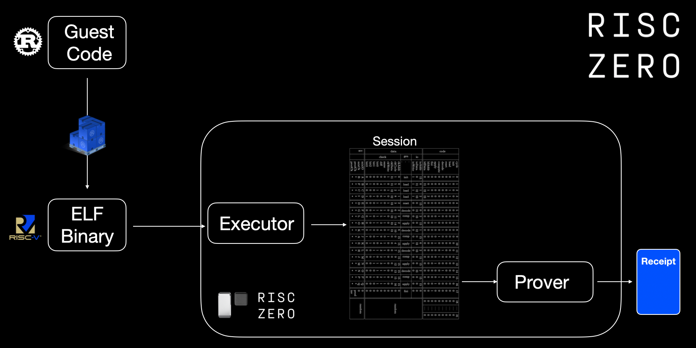
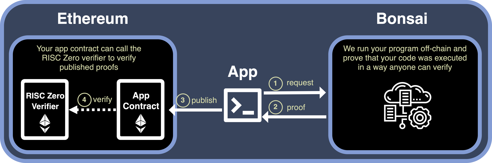

<link rel="stylesheet" href="../../../tools/styles/r0-theme.css">

<section data-background-opacity=0.3>

# RISC Zero  Verifiable Games

**_On-chain_ $~~~$ 👉 $ZK$ 👈 $~~~$ _Off-chain_**

<a target="_blank" href="https://nuke-web3.github.io/book/risc-zero/zypher-buildathon/materials.html">Event Materials ↗️</a>

---

## Why RISC Zero?

- **Verifiable Computation**: outsource-able
- **Highly Scalable**: low-cost verification
- **Tunable Privacy**: robust & universal\*

Notes:

- you can verify that a computation of a specific program ran exactly as it should, even if done by untrusted executor!
- _Prover_ that runs program & produces _receipt_ reveals as little as nothing to everything about execution to _verifier_.
- Verification is significantly cheaper than running computation yourself... at the cost of prover doing significantly more work to run the _zkVM_
- \* Privacy is from everyone outside the prover, if you are the prover, no one but you has secret data.

---

## What problems can ZK address for games?

<nuke-cols>
<nuke-col center>

### On-chain & Web3

- calldata limits restrict complexity
- prohibitive gas costs
- most blockchains lack privacy

</nuke-col>
<nuke-col center>

### Off-chain & Web2

- Cheating through manipulation of official game logic
- Private game aspects without any 3rd party / admin to adjudicate

</nuke-col>
</nuke-cols>

> See <a target="_blank" href="https://zyphergames.notion.site/gZKm-supporting-content-528587063a314eabb9eb1ecc1d87b8b0">Zypher's supporting content</a> for more.

Notes:

- **ZK coprocessor** - run verifiable program logic in zkVM by 3rd party or yourself to untrusting parties
- Added **security** and **fairness** and **privacy** that zero-knowledge proofs can provide, as they involve complex decision-making and competitive interactions.
- Commonly turn based, but can simply be tick based (STF analogy -> blocks)
- Privacy is optional, fully transparent games with ZKPs _can_ provided added guarantees around many things other than that (if carefully designed)
  - cheating specifically in being able to go around rules of game logic, especially in cases with hidden player data/logic. (Don't trust. verify!)
- Private:
  - moves of known players
  - cards in your hand / hidden from all deck shuffle
  - hidden ID / anonymous interactions in multiplayer
  - Enabling incomplete information games (e.g. “fog of war” mechanics)
- Can prove final score without revealing _anything_ about the game that resulted in it! Proof of Exploit CTF.

- Off-chain: CFT game where you prove you got a flag without revealing it (because that needs to remain secret) no 3rd party to check, use a proof!

---

## RISC Zero Track Objective

> Develop games using RISC Zero to ensure **privacy and fairness**.

Notes:

Developers are encouraged to implement game designs that can verify player actions without disclosing specific game data. This approach allows for the exploration of new gaming models that operate off-chain but utilize on-chain verification to ensure transparency and fairness.

---

## RISC Zero 101

> Read <a target="_blank" href="https://dev.risczero.com/api/getting-started">Getting Started</a> and/or watch the <a target="_blank" href="https://www.youtube.com/playlist?list=PLcPzhUaCxlCj7wKkzekYYq7QDvtGTOPm7">playlist</a>.

Notes:

- deeper understanding as exercise for views of this presentation.
- very happy to answer questions on our discord!

---

## RISC Zero On-chain

> Read about <a target="_blank" href="https://dev.risczero.com/api/blockchain-integration/bonsai-on-eth">Blockchain Integration</a> and watch the <a target="_blank" href="https://www.youtube.com/playlist?list=PLcPzhUaCxlCgsTtFen4oxFIDkUMSVSFFo">Foundry Template playlist</a>.

Notes:

- TODO diagram how the proof works in game context (seq. diagrams with actors IDed (player, execution, prover))

---

# ✨ Inspiration

##### ⚠️ -- Do not copy 🍝 -- 🙏

Notes:

Plagiarism, missing attribution and violating licenses will disqualify you!
Building on them to something significantly enhancements _**may**_ be considered - please let us know what you are planning :grin:

---

## ZK Checkmate Demo

<!-- FIXME link that works in book and slides and gh-pages -->

Join in following the [Hands-on instructions ↗️](./workshop.md)

Notes:

- See the recording there to follow along for an overview.
- I encourage you to experiment yourself!

---

## <a target="_blank" href="https://github.com/risc0/risc0/tree/v1.0.1/examples/bevy">Bevy (R0 v1.0.1)</a>

- **Serious** Rust <a target="_blank" href="https://bevyengine.org/">game engine</a>
- Great base to start hackin' 🤠
- Start with shared `core` logic

Notes:

- Core logic can be used in the host & the guest for Bevy games
- Design guest to be _minimal_ as proofs are costly!

---

## <a target="_blank" href="https://devfolio.co/projects/zksnake-c689">zkSnake (R0 v0.20)</a>

<iframe loading=lazy width="560" height="315" src="https://www.youtube-nocookie.com/embed/zkMqd_AhCFU" title="YouTube video player" frameborder="0" allow="accelerometer; autoplay; clipboard-write; encrypted-media; gyroscope; picture-in-picture; web-share" referrerpolicy="strict-origin-when-cross-origin" allowfullscreen></iframe>

#### <a target="_blank" href="https://github.com/0xAndoroid/zkSnake">zkSnake Source ↗️</a>

Notes:

- Winner of RISC Zero Coprocessor Bounty at ETHDenver 2024 and did well in community quadratic voting too!
- Idea: take it further and make a bevy app in wasm w/ webGPU with **shared core logic identical on web & "re-player" zkVM**

---

## 3D ZK Games?!

#### <a target="_blank" href="https://bevyengine.org/examples/Games/alien-cake-addict/">🎮 Play the Demo 🎮</a>

- <a target="_blank" href="https://zyphergames.notion.site/Invitation-gZKm-Provable-Games-Buildathon-1e52aef746874bf08ff1a12c4eed799b?p=77dac845c4984302b9d43a34cc7c2892&pm=c">Real-time Multiplayer Games Track</a> featured demo!
- <a target="_blank" href="https://github.com/zypher-game/Alien-Cake-Addict">Rendered web game + wallet connect</a>
- <a target="_blank" href="https://github.com/bevyengine/bevy-website/blob/main/generate-wasm-examples/generate_wasm_examples.sh">Demo tooling</a> to generate browser example

---

## 🎨 ZK Game Design Patterns

- Prove transcript of game for verifiable high scores
- Prove state update based on complex game logic
- Prove validity of player moves while concealing
- Play & prove latter (snake game)
- Proof for each hidden move, perhaps in a tx on chain
- Able to run only core game logic in zkVM - GUI and other non-security/privacy/fairness aspects can live outside the proven core logic (diagram)
- Randomness
  - cannot do within guest - only fake & deterministic random for replay of moves perhaps (who gets to know seed? Choose? VRF maybe?)

---

## 🎇 What is special about RISC Zero? (1)

- Developer productivity (@ hackathons & beyond)
   &nbsp; Top 1000 <a target="_blank" href="https://crates.io/">crates.io</a> tested nightly,
   &nbsp; benchmarks and more: <a target="_blank" href="https://reports.risczero.com/">reports.risczero.com</a>
- Hard in zkDSL, easy in zkVM:
   &nbsp; Loops & branching
   &nbsp; Design 🡺 Implementation 🡺 Auditing

Notes:

- Lots of ZKP options, why use R0?
  - zkDSL _could_ be more performant, but time to market is very high, small set of humans can implement them at all.
  - Why use us over other zkVMs?
    First, arguably best devex, v1.0 release stability and prover performance milestones!

---

## 🎇 What is special about RISC Zero? (2)

- Proof <a target="_blank" href="https://www.risczero.com/blog/continuations">continuation</a>
   &nbsp; Unbounded guest programs
- Proof <a target="_blank" href="https://www.risczero.com/blog/proof-composition">composition</a>
   &nbsp; "Proof-ception"
   &nbsp; Hybrid Client side {🕵️privacy} & server {🦾power}
- Execution _separate_ from proof generation

Notes:

- Proof-ception = efficient verification of proofs within a guest.
  - Privacy for small client side proofs and the bulk of proof computational overhead outsourced to an untrusted prover.
  - Reuse of existing proofs included in new proof using their journal
  - Batching/compression of many proofs
  - Proof transposition for compatibility of specific verifiers.
- Execution is near zero overhead, proving is high overhead.
  - Realtime exec & prove in parallel / after / remote is possible
- What killer features does R0 provide?

---

## 🎇 What is special about RISC Zero? (3)

### ⛓️ EVM Support

- <a target="_blank" href="https://github.com/risc0/risc0-foundry-template">RISC Zero Foundry template</a>
   &nbsp; Write unbounded programs that are low cost to verify on any EVM chain
- <a target="_blank" href="https://github.com/risc0/risc0-ethereum">Ethereum contracts, proof systems, and more</a>
   &nbsp; View call proofs with **Steel**
   &nbsp; ZK Rollups & RollApps
   &nbsp; ... Help us define more!

Notes:

- Zeth _could_ run existing solidity games off chain, optionally unbounded computation per block (gasless). [Zeth deep dive](https://www.youtube.com/watch?v=4pBmf839eOA)
- mention: 256 view call limit - could you do inclusion proof checkpoints? contract state is simply recursive proof of minimal thing needed (maybe block header / hash?) updated by anyone to use for deep archival view calls? prove "this state was in block X that is a child of recent block {younger than 256}"

---

## 🎇 What is special about RISC Zero? (4)

### ✨Zypher Support

## <a target="_blank" href="https://github.com/zypher-game/poker0"> `poker0` ↗️</a>

> A poker game leveraging RISC Zero and PLONK for off-chain proof of game processes, with on-chain validation, built on the <a target="_blank" href="https://github.com/zypher-game/z4">Z4 engine</a>.

Notes:

Take heed: This perhaps is a rather complex starting point from without any experience with RISC Zero or PLONK, we suggest experimenting with the more basic RISC Zero examples first to get a feel for things first!

---

## 🤿 Before you dive deep...

- You _must_ match versions of `cargo risczero` and your Cargo.toml deps
   &nbsp; Some examples / templates may not be the version you need!
   &nbsp; Bonsai (proving service) is 0.21, updating mid-July 2024 to 1.0
- Keep guest minimal - extra cycles are _**expensive**_
   &nbsp; ...But this is a hackathon, don't stress too much!
- When experimenting, always use <a target="_blank" href="https://dev.risczero.com/api/generating-proofs/dev-mode"> `DEV_MODE`</a>!
   &nbsp; Execution _only_ with mocked proving (fast!)
- Bonsai API key priority & support
   &nbsp; Apply: <a target="_blank" href="https://www.bonsai.xyz/">bonsai.xyz/</a>
- 🧠 You are designing a cryptographic system, not just a game!
- Discord `#💻|support-forum` channel for help
   &nbsp; Join: <a target="_blank" href="https://discord.com/invite/risczero">discord.gg/risczero</a>

---

# Further Reading & Resources

## <a target="_blank" href="https://nuke-web3.github.io/book/risc-zero/zypher-buildathon/materials.html">Nuke 🌄's Book ↗️</a>

- 🗃️ More details and research links
- 🪧 These slides (fuzzy-searchable!)
- 👷 ZK Chess Checkmate Workshop (+videos)
